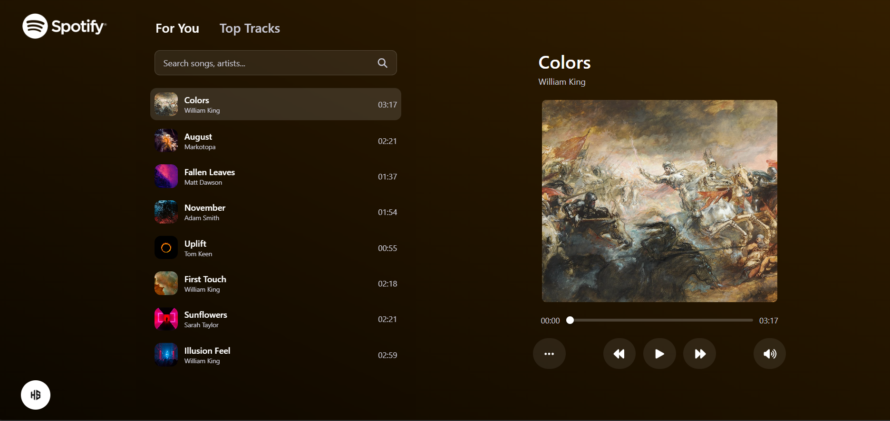

# Spotify Music Player (React + Vite)

A responsive music player that has the following features: search, tabs ("For You", "Top Tracks"), play/pause/next/prev, seeker and volume control, animated loading, and a background gradient that adapts to the current cover image.

## Run locally

```bash
npm install
npm run dev
```

## Build for production

```bash
npm run build
npm run preview
```

## Notes

- Songs are fetched from `https://cms.samespace.com/items/songs`, and cover images are displayed from `https://cms.samespace.com/assets/{COVER_IMAGE_ID}`.
- The gradient background is computed from the current cover using a lightweight canvas-based dominant color extraction, and transitions automatically when the track changes.
- On small screens, the sidebar (song list) becomes a slide-out drawer toggled with the menu button, making the player the main interface.
- HTML5 audio keeps playing even if the user switches browser tabs (no auto-pause is triggered by page visibility changes).


## Final UI


